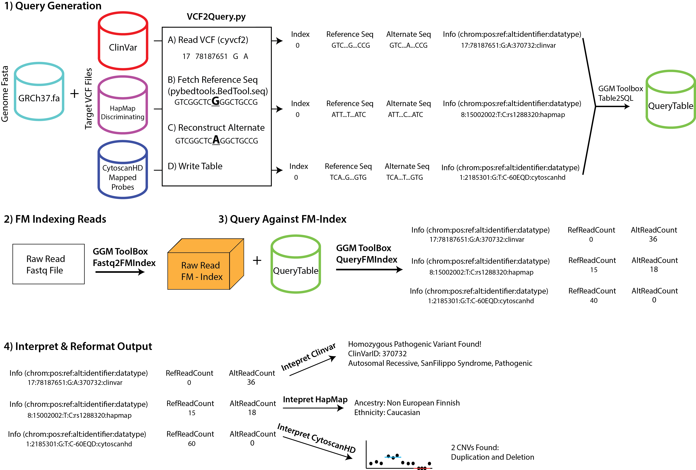

# FlexTyper

> An FM-index based tool for rapid searching of interesting variants/sequences within unmapped short read sequences

Contributers:

+ Alice Kaye
+ Phillip Richmond
+ Jacques KOUNKOU
+ Tamar AvShalom

 |
 |
 |
 |
:---: | :---: | :---: | :---: | 
[Alice Kaye](https://github.com/tixii) | [Phillip Richmond](https://github.com/Phillip-a-richmond) | [Jacques KOUNKOU](https://github.com/kounkou) | [Tamar AvShalom](https://github.com/tamario)

## Overview

## A little paragraph

The purpose of FlexTyper is to rapidly query an unmapped read file (fastq) for variants/kmers of interest. The core of FlexTyper relies on the FM-index of the raw reads, developed by Alice Kaye. This indexed read set is designed for rapid queries of kmers, sequence substrings of length ‘k’, against an entire set of unmapped reads. With this ability to rapidly scan for substrings against an unmapped read set, we can perform meaningful queries for a variety of applications including genotyping for presence of pathogenic variants, coverage analysis for known probes contained within the CytoscanHD chromosomal microarray set, and ancestry/ethnicity inference from population discriminating polymorphisms. The tool is designed in a flexible manner with respect to the query capabilities, making it available for extension to other organisms, genome versions, and applications. We anticipate that FlexTyper’s utility will grow as datasets cataloguing variants of interest continue to expand.

